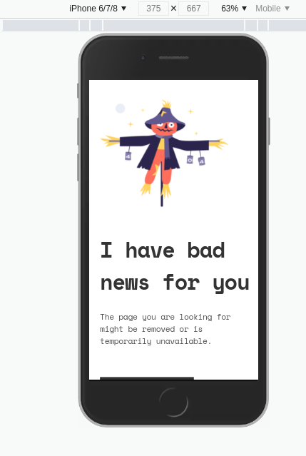

<!-- Please update value in the {}  -->

<h1 align="center">{404-NOT-FOUND-PAGE}</h1>

   Solution for a challenge from  <a href="http://devchallenges.io" target="_blank">Devchallenges.io</a>.

  <h3>
    <a href="https://{your-demo-link.your-domain}">
      Demo
    </a>
     | 
    <a href="https://{your-url-to-the-solution}">
      Solution
    </a>
     | 
    <a href="https://devchallenges.io/challenges/wBunSb7FPrIepJZAg0sY">
      Challenge
    </a>
  </h3>

<!-- TABLE OF CONTENTS -->

## Table of Contents

- [Overview](#overview)
  - [Built With](#built-with)
- [Features](#features)
- [Contact](#contact)
- [Acknowledgements](#acknowledgements)

<!-- OVERVIEW -->

## Overview

A responsive 404 page, built for screen sizes 375px and 1440px.
I tried as much as possible to make it as close to the design.

 

I enjoyed completing this challenge, working with actual design files is quite interesting.

I used google chrome browser for development.

- Where can I see your demo?
  - checkout my solution [404-NOT-FOUND](https/githubpages)

all feedback will be appreciated.

### Built With

<!-- This section should list any major frameworks that you built your project using. Here are a few examples.-->

- HTML
- CSS
- no frameworks or libraries used.

## Features

<!-- List the features of your application or follow the template. Don't share the figma file here :) -->

This application/site was created as a submission to a [DevChallenges](https://devchallenges.io/challenges) challenge. The [challenge](https://devchallenges.io/challenges/wBunSb7FPrIepJZAg0sY) was to build an application to complete the given user stories.

## Acknowledgements

<!-- This section should list any articles or add-ons/plugins that helps you to complete the project. This is optional but it will help you in the future. For exmpale -->

- [Steps to replicate a design with only HTML and CSS](https://devchallenges-blogs.web.app/how-to-replicate-design/)
- [Marked - a markdown parser](https://github.com/chjj/marked)
- [devChallenges.io](https://devChallenges.io)

## Contact

- Website [your-website.com](https://{your-web-site-link})
- GitHub [@DoIfeanyichukwu](https://{github.com/DoIfeanyichukwu})
- Twitter [@DoIfeanyichukwu](https://{twitter.com/DoIfeanyichukwu})
